# Architecture — DevOps/SRE Local Infrastructure

> Production-like local environment for DevOps/SRE training.
> Last updated: 2026-04-01

---

## Table of Contents

1. [High-Level Overview](#1-high-level-overview)
2. [Network Architecture](#2-network-architecture)
3. [Service Map & Ports](#3-service-map--ports)
4. [Data Flow](#4-data-flow)
5. [CI/CD Pipeline](#5-cicd-pipeline)
6. [Monitoring Stack](#6-monitoring-stack)
7. [Security Architecture](#7-security-architecture)
8. [Backup & DR Architecture](#8-backup--dr-architecture)
9. [Kubernetes Architecture](#9-kubernetes-architecture)
10. [Component Dependencies](#10-component-dependencies)

---

## 1. High-Level Overview

```mermaid
graph TB
    subgraph "Entry Points"
        TRAEFIK["Traefik :80/:443/:8080"]
        HAPROXY["HAProxy :8090"]
        NGINX["Nginx RP :8091"]
    end

    subgraph "CI/CD Layer"
        JENKINS["Jenkins :8081"]
        GITEA["Gitea :3001"]
        ARGOCD["ArgoCD :8083"]
    end

    subgraph "Application Layer"
        APP1["app-frontend :8000"]
        APP2["app-backend :8001"]
        APP3["app-worker :8002"]
    end

    subgraph "Orchestration"
        K3S["K3s / Kubernetes :6443"]
    end

    subgraph "Databases"
        PG["PostgreSQL :5432"]
        MYSQL["MySQL :3306"]
        REDIS["Redis :6379"]
        MONGO["MongoDB :27017"]
    end

    subgraph "Messaging"
        KAFKA["Kafka :9092"]
        ZK["ZooKeeper :2181"]
        RABBIT["RabbitMQ :5672/:15672"]
    end

    subgraph "Storage"
        MINIO["MinIO :9001/:9002"]
        NEXUS["Nexus :8084"]
        REGISTRY["Registry :5000"]
    end

    subgraph "Security"
        VAULT["Vault :8200"]
        CONSUL["Consul :8500"]
        KEYCLOAK["Keycloak :8085"]
    end

    subgraph "Monitoring Stack"
        PROM["Prometheus :9090"]
        GRAFANA["Grafana :3000"]
        ALERT["AlertManager :9093"]
        LOKI["Loki :3100"]
        PROMTAIL["Promtail :9080"]
    end

    subgraph "ELK Stack"
        ES["Elasticsearch :9200"]
        KIBANA["Kibana :5601"]
        LOGSTASH["Logstash :5044"]
    end

    subgraph "Code Quality"
        SONAR["SonarQube :9001"]
    end

    TRAEFIK --> APP1
    TRAEFIK --> APP2
    TRAEFIK --> GRAFANA
    HAPROXY --> TRAEFIK
    NGINX --> GRAFANA
    NGINX --> PROM
    NGINX --> KIBANA

    JENKINS --> GITEA
    JENKINS --> NEXUS
    JENKINS --> REGISTRY
    JENKINS --> SONAR
    ARGOCD --> K3S

    APP2 --> PG
    APP2 --> REDIS
    APP2 --> MONGO
    APP3 --> KAFKA
    APP3 --> RABBIT

    K3S --> PG
    K3S --> REDIS

    VAULT --> CONSUL
    KEYCLOAK --> PG

    PROM --> GRAFANA
    PROM --> ALERT
    LOKI --> GRAFANA
    PROMTAIL --> LOKI
    LOGSTASH --> ES
    ES --> KIBANA
```

---

## 2. Network Architecture

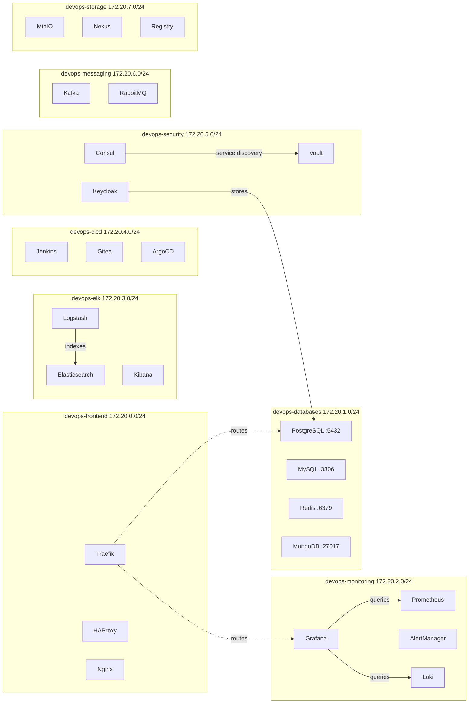

---

## 3. Service Map & Ports

| Service | Port | Network | Category | Status Default |
|---------|------|---------|----------|----------------|
| PostgreSQL | 5432 | databases | DB | stopped |
| MySQL | 3306 | databases | DB | stopped |
| Redis | 6379 | databases | DB | stopped |
| MongoDB | 27017 | databases | DB | stopped |
| Prometheus | 9090 | monitoring | Monitoring | stopped |
| Grafana | 3000 | monitoring | Monitoring | stopped |
| AlertManager | 9093 | monitoring | Monitoring | stopped |
| Loki | 3100 | monitoring | Monitoring | stopped |
| Promtail | 9080 | monitoring | Monitoring | stopped |
| Node Exporter | 9100 | host | Exporter | stopped |
| cAdvisor | 8088 | host | Exporter | stopped |
| PG Exporter | 9187 | databases | Exporter | stopped |
| Redis Exporter | 9121 | databases | Exporter | stopped |
| MySQL Exporter | 9104 | databases | Exporter | stopped |
| MongoDB Exporter | 9216 | databases | Exporter | stopped |
| Nginx Exporter | 9113 | frontend | Exporter | stopped |
| Blackbox Exporter | 9115 | monitoring | Exporter | stopped |
| Elasticsearch | 9200 | elk | ELK | stopped |
| Kibana | 5601 | elk | ELK | stopped |
| Logstash | 5044 | elk | ELK | stopped |
| Jenkins | 8081 | cicd | CI/CD | stopped |
| Gitea | 3001 | cicd | CI/CD | stopped |
| ArgoCD | 8083 | cicd | CI/CD | stopped |
| Vault | 8200 | security | Security | stopped |
| Consul | 8500 | security | Security | stopped |
| Keycloak | 8085 | security | Security | stopped |
| Kafka | 9092 | messaging | Messaging | stopped |
| RabbitMQ AMQP | 5672 | messaging | Messaging | stopped |
| RabbitMQ Mgmt | 15672 | messaging | Messaging | stopped |
| MinIO API | 9001 | storage | Storage | stopped |
| MinIO Console | 9002 | storage | Storage | stopped |
| Nexus | 8084 | storage | Storage | stopped |
| Docker Registry | 5000 | storage | Storage | stopped |
| Traefik HTTP | 80 | frontend | Proxy | stopped |
| Traefik HTTPS | 443 | frontend | Proxy | stopped |
| Traefik Dashboard | 8080 | frontend | Proxy | stopped |
| HAProxy | 8090 | frontend | LB | stopped |
| Nginx RP | 8091 | frontend | Proxy | stopped |
| SonarQube | 9001 | cicd | Quality | stopped |
| K3s API | 6443 | host | K8s | stopped |
| etcd | 2379 | host | K8s | stopped |

---

## 4. Data Flow

### Log Collection Pipeline

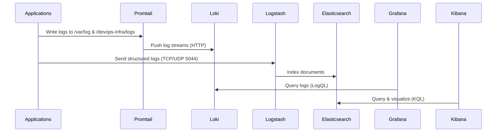

### Metrics Collection Pipeline

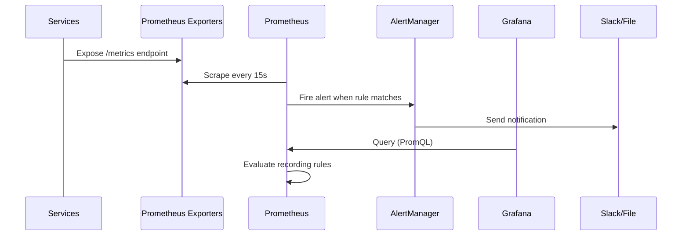

---

## 5. CI/CD Pipeline

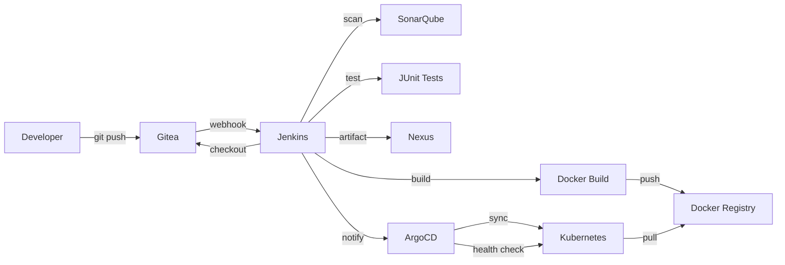

### Pipeline Stages

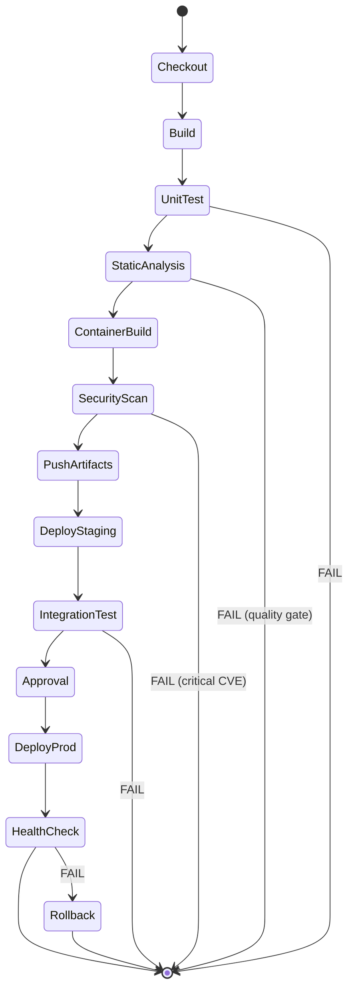

---

## 6. Monitoring Stack

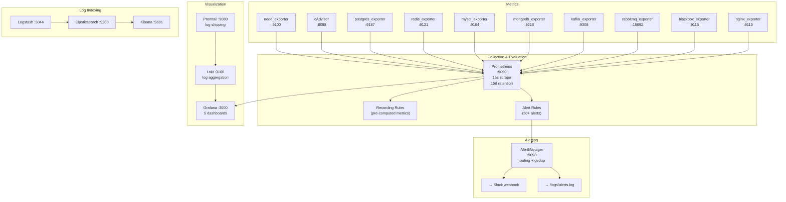

---

## 7. Security Architecture

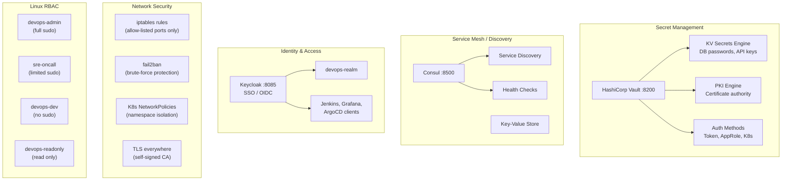

---

## 8. Backup & DR Architecture

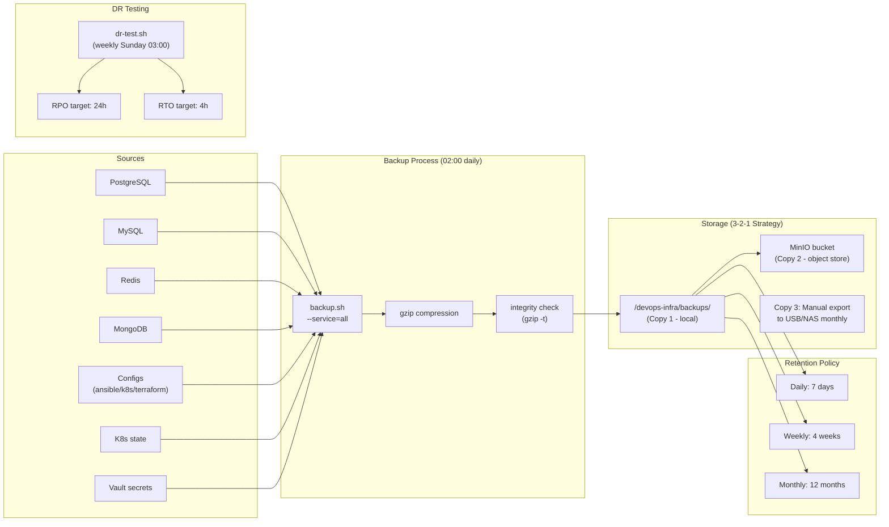

---

## 9. Kubernetes Architecture

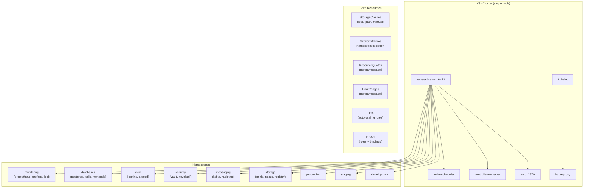

---

## 10. Component Dependencies

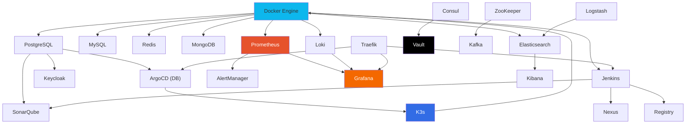

---

## Quick Reference

### Start minimal monitoring stack
```bash
cd ~/devops-infra
make db-start
make monitoring-start
```

### Start full stack (resource heavy ~8GB RAM)
```bash
make up
```

### Check what's running
```bash
make status
make health
```

### Access UIs
| Service | URL | Credentials |
|---------|-----|-------------|
| Grafana | http://localhost:3000 | admin/admin |
| Prometheus | http://localhost:9090 | - |
| AlertManager | http://localhost:9093 | - |
| Kibana | http://localhost:5601 | elastic/DevOps2024!ES |
| Jenkins | http://localhost:8081 | admin/admin |
| Vault | http://localhost:8200 | token: dev-root-token |
| Consul | http://localhost:8500 | - |
| Keycloak | http://localhost:8085 | admin/DevOps2024!KC |
| MinIO | http://localhost:9002 | minioadmin/DevOps2024!Minio |
| Nexus | http://localhost:8084 | admin/(first-time setup) |
| Traefik | http://localhost:8080 | - |
| RabbitMQ | http://localhost:15672 | admin/DevOps2024!RMQ |
| Gitea | http://localhost:3001 | (setup on first access) |
| SonarQube | http://localhost:9001 | admin/admin |
